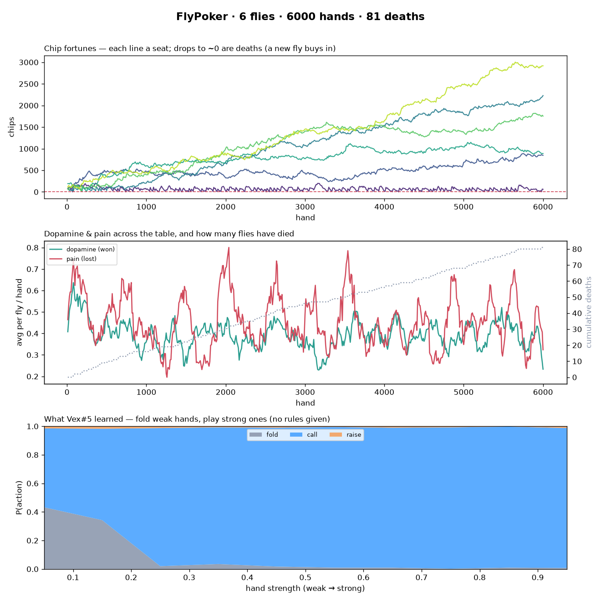

# 🪰♠️ FlyPoker

**A table of fruit-fly brains that learn to play poker — and die when they go broke.**
Six flies ante up, get dealt real cards, and each decides **fold / call / raise**
from its perceived hand strength. Winners get a hit of **dopamine**, losers a jolt
of **pain (PPL1)**, and the result rewrites the fly's brain. Bust your chips and
you **die** — a fresh fly buys into your seat. Nobody is told the rules of poker;
they learn them from dopamine.

It's the [FlyGambler](https://github.com/jaylendilkhush2028/flygambler) idea —
the fruit-fly mushroom body as a dopamine reinforcement-learning machine — made
**multi-agent and competitive**.



*6 flies, 6000 hands. Top: chip fortunes per seat (a drop to ~$0 is a fly busting;
a new one buys in). Middle: dopamine vs. pain across the table, and the climbing
death count. Bottom: the strategy the top fly **learned** — fold weak hands, play
strong ones — with no rules given.*

---

## The idea

Each fly carries the same brain as FlyGambler: a cue (here, its hand strength +
the pot/opponents) is expanded into a sparse **Kenyon-cell** code, and
dopamine-gated weights read out a value for **fold / call / raise**. It picks an
action, sees the chips it won or lost, and a three-factor rule (Kenyon-cell
activity × dopamine) nudges the weights — so each action's value converges to its
real payoff *for that kind of hand*. That's why a fly learns to fold trash and bet
quality. Losing streaks also build a slow **mood**, which can optionally make a fly
**tilt** (chase when sad).

## What's real vs. simplified

- **Real:** a 52-card deck, real 2-hole + 5-community Texas Hold'em deals, and a
  correct 5-of-7 hand evaluator (straights, flushes, full houses, the wheel, …).
- **Real:** the learning is genuine dopamine-style reinforcement learning on a
  mushroom-body-shaped brain; folding weak / playing strong is *learned*, not coded.
- **Simplified:** one commitment decision per hand (fold / call B / raise 2B),
  resolved simultaneously, then a showdown — so the enormous sequential
  betting/raising tree of full No-Limit Hold'em (a Pluribus-scale problem) stays
  out of scope while keeping cards, hand rankings, folding, pot odds, and bluffing.
- This is a fast **behavioral** model of the circuit so a whole table can play
  thousands of hands; the connectome-backed spiking version lives in FlyGambler.
- A model for fun and curiosity — **not** gambling advice.

## Quickstart

```bash
python3 -m venv .venv && source .venv/bin/activate
pip install -e .
python scripts/run_table.py                      # 6 flies, 6000 hands
python scripts/run_table.py --seats 8 --hands 12000 --tilt 0.6
```

Writes `runs/table.json` and `runs/table.png` (chip fortunes, dopamine/pain +
deaths, and the policy the top fly learned). Runs are randomized each time; pass
`--seed N` to reproduce.

## One hand, step by step

1. Every living fly antes; each is dealt 2 hole cards + 5 shared community cards.
2. Each fly evaluates its best 5-of-7 hand → a **hand-strength** cue → sparse KC code.
3. It reads action values and picks **fold / call / raise** (with a little exploration).
4. Non-folders go to **showdown**; the best hand takes the whole pot.
5. Chips won/lost → **dopamine / pain** → the KC→action weights are updated.
6. A fly that can't cover the next ante **dies**; a fresh fly (new brain) takes the seat.

## Layout

```
flypoker/   cards.py (deck + 7-card evaluator) · agent.py (the fly brain) ·
            table.py (deal/bet/showdown/death) · simulate.py · plots.py
scripts/    run_table.py
tests/      hand-evaluator + learning tests
assets/     the README figure
```

## Credits

Built on the FlyGambler project and the fruit-fly mushroom-body learning biology
(Aso, Hige, Cohn, Owald et al.); real hand evaluation is standard poker maths.
The poker task, the multi-agent ecology, and the fly agent are this project's own.
